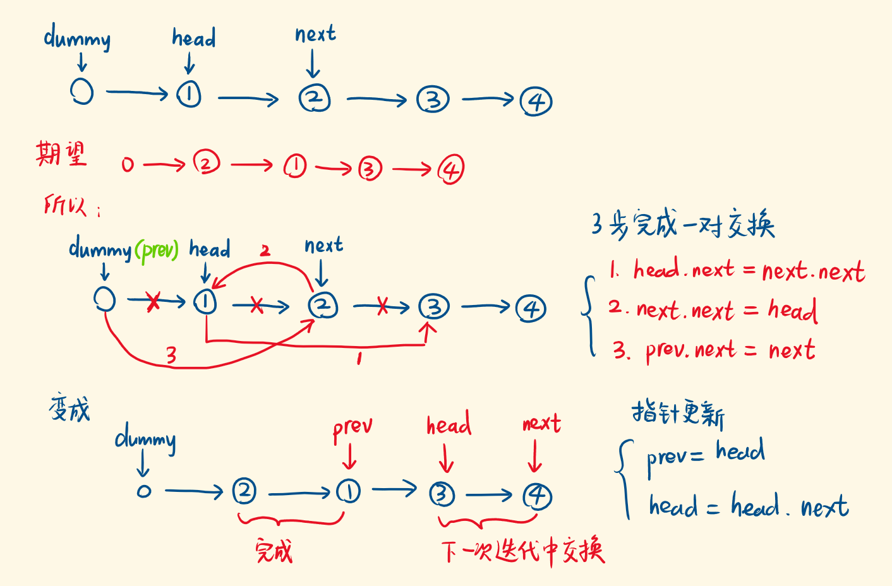

# 两两交换链表中的节点

给定一个链表，两两交换其中相邻的节点，并返回交换后的链表。

你不能只是单纯的改变节点内部的值，而是需要实际的进行节点交换。

示例:

给定 1->2->3->4, 你应该返回 2->1->4->3.

## 思路

- 设置虚拟头结点 dummy，使得 dummy.next 始终指向第一个结点。
- 开启 while 循环，三步完成一对结点的交换，具体见图。
- 指针更新，在下一轮迭代中，完成下一对结点的交换。
- 时间复杂度 O(n)，空间复杂度 O(1)



```js
var swapPairs = function (head) {
  const dummyHead = new ListNode(0);
  dummyHead.next = head;
  let prev = dummyHead;

  while (head && head.next) {
    const next = head.next;
    head.next = next.next;
    next.next = head;
    prev.next = next;

    prev = head;
    head = head.next;
  }

  return dummyHead.next;
};
```

来源：力扣（LeetCode）  
链接：[LeetCode 原题](https://leetcode-cn.com/problems/swap-nodes-in-pairs)  
著作权归领扣网络所有。商业转载请联系官方授权，非商业转载请注明出处。
